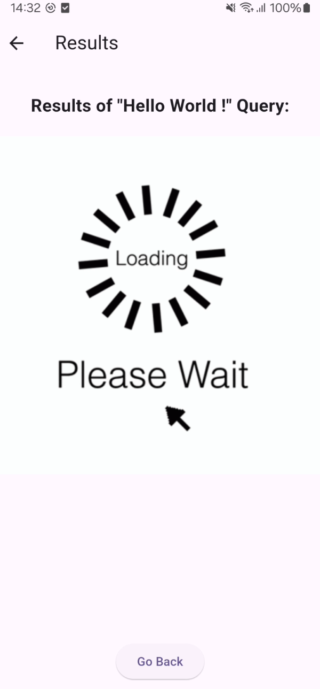
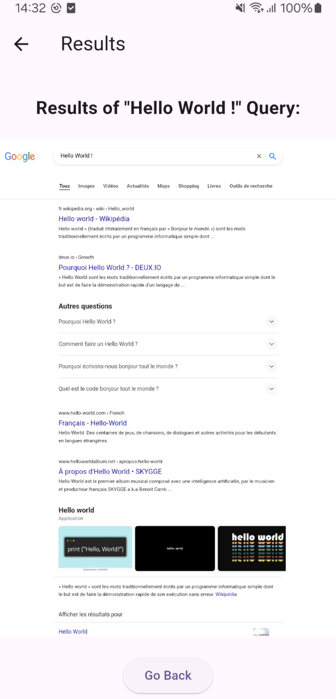

# Ormaes Flutter Training

This is my first Flutter project, created to introduce myself to Object-Oriented Programming during my internship at Ormaes Company.

## OrmaSearch

### Project Overview

The goal of this project was to develop an app that utilizes state management with events, a clean UI, and PageRoute for navigation between different pages. These personal requirements were set to help me get hands-on experience with all the basic functionalities of Flutter.

### Features

- **State Management**: Efficient handling of app states using events.
- **Clean UI**: A user-friendly and visually appealing interface.
- **Page Navigation**: Seamless navigation between different pages using PageRoute.

### Functionality

OrmaSearch is essentially a "browser" that allows users to make queries and search on Google using this Android app.

### Demo

